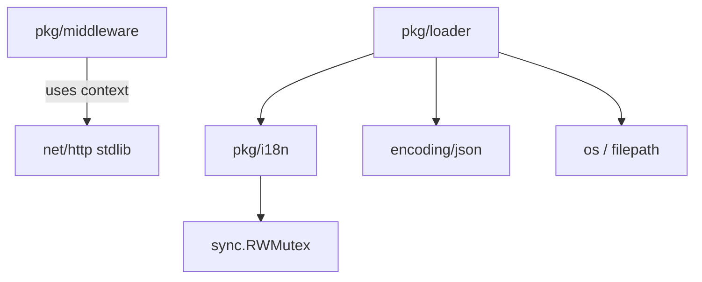
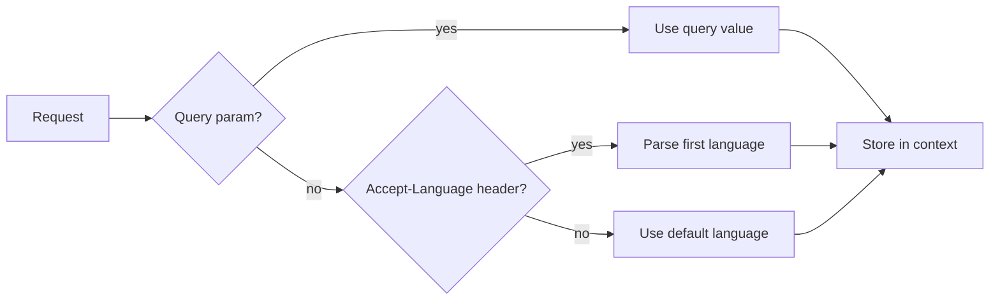
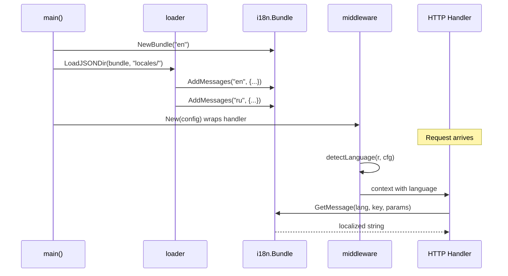

# Architecture -- digital.vasic.i18n

## Module Overview

`digital.vasic.i18n` is a server-side Go internationalization module with three packages that handle message storage, message loading, and HTTP language detection. It has zero framework dependencies (uses only `net/http` for middleware) and a single test dependency (`testify`).

## Package Dependency Graph

The `middleware` package is independent of `i18n` and `loader` -- it only manages the language context key. The `loader` package depends on `i18n` to populate bundles. The `i18n` package has no internal dependencies beyond the standard library.

## Package Responsibilities

### pkg/i18n -- Core Bundle

Owns the `Bundle` struct, which is the central data store:

- **Storage**: Nested map `map[string]map[string]string` (language -> key -> message).
- **Concurrency**: All reads use `RLock`, all writes use `Lock` via `sync.RWMutex`. Safe for concurrent access from multiple goroutines/HTTP handlers.
- **Lookup chain**: requested language -> default language -> return raw key.
- **Template substitution**: Replaces `{{VarName}}` placeholders using `strings.ReplaceAll` and `fmt.Sprint` for value conversion.

### pkg/loader -- Message Loading

Provides three strategies to populate a `Bundle`:

| Function | Source | Language detection |
|----------|--------|--------------------|
| `LoadJSON` | Single JSON file | Caller specifies language |
| `LoadJSONDir` | Directory of JSON files | Filename minus `.json` extension |
| `LoadMap` | Go map literal | Map keys are language codes |

### pkg/middleware -- HTTP Language Detection

Standard `net/http` middleware (not Gin-specific). Detection priority:

The `Accept-Language` parser extracts only the base language code (e.g., `ru` from `ru-RU,ru;q=0.9,en;q=0.8`). Quality weights are not evaluated; the first listed language wins.

## Data Flow

A typical server wires all three packages together at startup:

## Design Decisions

- **No framework coupling**: The middleware uses `net/http` so it works with any router (Gin, Chi, stdlib mux). Framework-specific adapters can wrap it.
- **Flat JSON format**: Message files use a simple `{ "key": "value" }` structure rather than nested namespaces. This keeps the Go-side API and file format minimal.
- **Key-as-fallback**: When a translation is missing entirely, `GetMessage` returns the key itself rather than an empty string or error. This makes missing translations visible in the UI without crashing.
- **Template syntax**: Uses `{{VarName}}` (double curly braces) which is familiar from Go templates and Mustache, but the substitution is a simple string replacement -- no expressions or logic.
